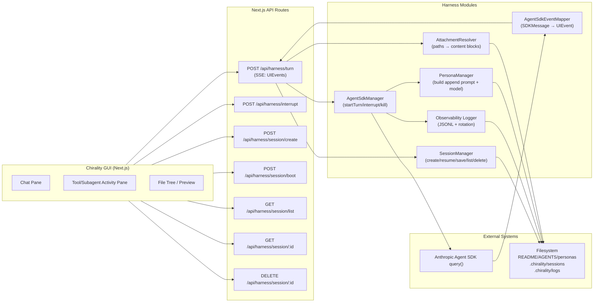
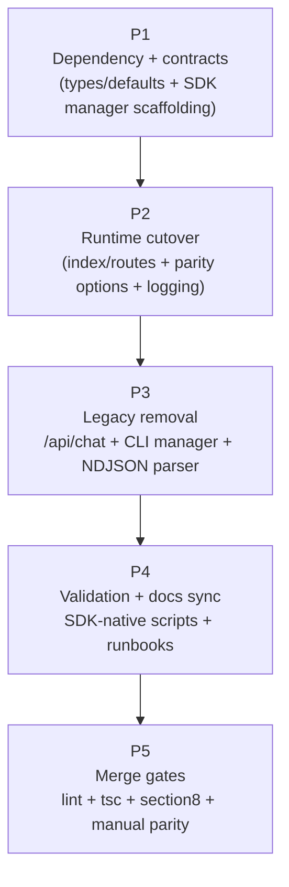
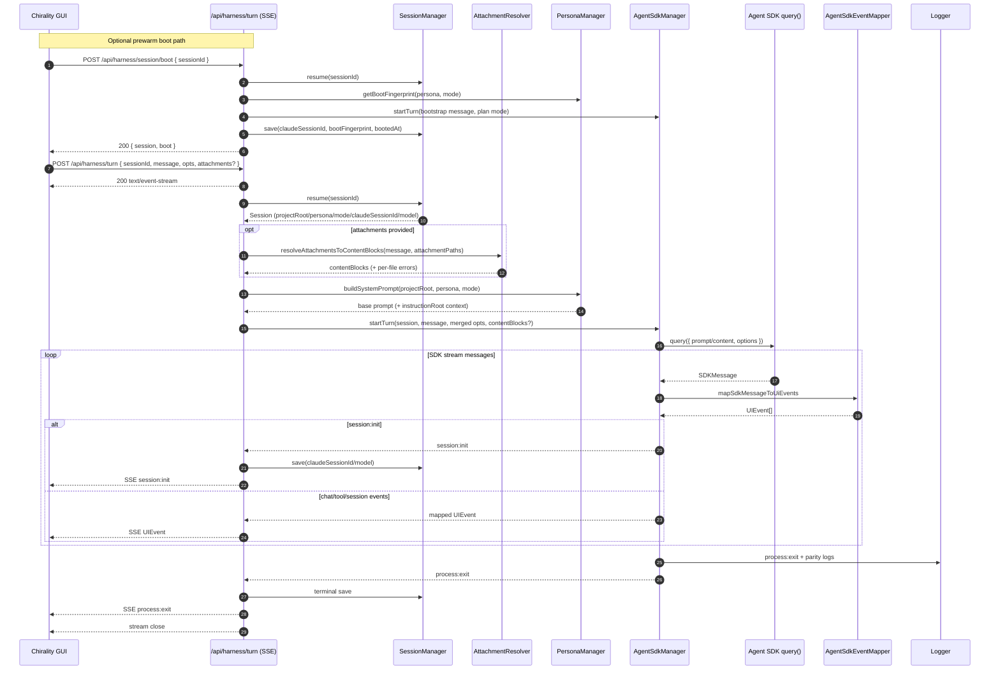

# Chirality Agent Harness (Anthropic Agent SDK) — Architecture Graphs & Turn Sequence

This document describes the SDK-only harness runtime after wholesale cutover.

1. Module dependency graph (runtime)
2. Implementation dependency graph (cutover-oriented)
3. `/api/harness/turn` sequence diagram

## 1) Module dependency graph (runtime)

## 2) Implementation dependency graph (cutover)

## 3) `/api/harness/turn` sequence diagram

